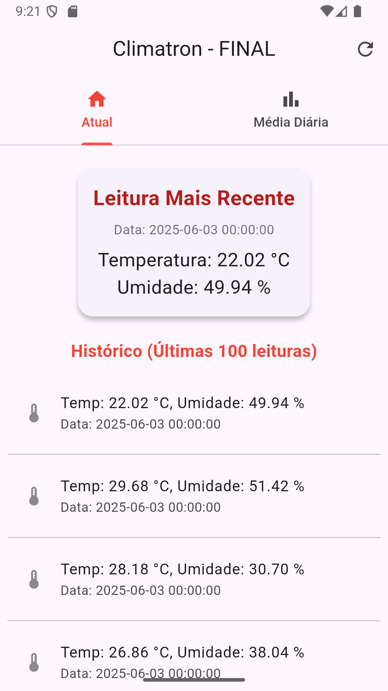
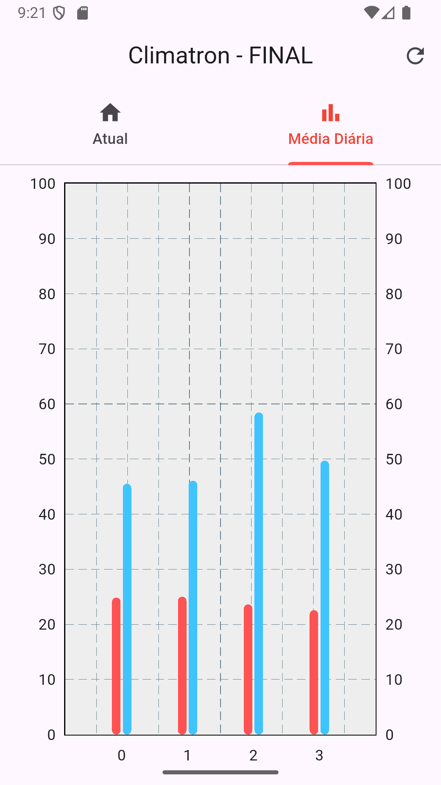

# 🌦️ Climatron

<div align="center">
  
  
  
  
</div>

<div align="center">
  <h3>📱 Aplicativo de Monitoramento Climático</h3>
  <p>Um app mobile desenvolvido em Flutter com backend Python e integração com Supabase para visualizar dados de temperatura e umidade de um ambiente.</p>
</div>


## 📋 Sobre o Projeto

O **Climatron** é uma aplicação mobile desenvolvida como projeto de desenvolvimento mobile para exibir informações climáticas precisas e atualizadas de um ambiente qualquer. A aplicação lê os dados do ambiente físico, manda para a API, que armazena informações em um banco de dados Supabase e oferece uma interface intuitiva para visualização de dados climáticos.

### ✨ Principais Funcionalidades

- 🌡️ **Monitoramento em Tempo Real**: Níveis de temperatura e umidade constantemente lidos e salvos para visualização
- 📊 **Visualização de Dados**: Gráfico e histórico de leituras
- 💾 **Armazenamento Seguro**: Integração com Supabase para persistência de dados e disponibilidade
- 🔄 **Sincronização**: Backend Python para processamento e API management
- 📱 **Interface Responsiva**: Design adaptável para diferentes dispositivos


## 🏗️ Arquitetura

```
📦 Climatron
├── 📱 Frontend (Flutter)
│   ├── UI/UX Voltado ao Mobile
│   └── Integrado com a API
├── 🐍 Backend (Python)
│   ├── Endpoints da API 
│   ├── Tratamento de dados
│   └── Recebe e envia do banco de dados
└── 🗄️ Banco de dados (Supabase)
    ├── PostgresSQL em cloud
    ├── Dados brutos e médias
    
```

## 🚀 Tecnologias Utilizadas

### Frontend
- **Flutter**: Framework principal para desenvolvimento mobile
- **Dart**: Linguagem de programação

### Backend
- **Python**: Linguagem principal do backend
- **Requests & Flask**: API para controle central dos dados

### Database & Services
- **Supabase**: Software de serviço cloud para autenticação e banco de dados
- **PostgreSQL**: Banco de dados relacional


## 📦 Instalação e Configuração

### Pré-requisitos

- Flutter SDK (versão >= 3.0)
- Python 3.8+
- Conta no Supabase
- Editor de código (VS Code, Android Studio, etc.)

### 🔧 Configuração do Ambiente

1. **Clone o repositório**
   ```bash
   git clone https://github.com/LucasPeva/Climatron.git
   cd Climatron
   ```

2. **Configuração do Flutter**
   ```bash
   flutter pub get
   flutter doctor
   ```

3. **Configuração do Backend Python**
   ```bash
   # De preferência, crie um venv para instalar os pacotes localmente
   cd backend
   pip install -r requirements.txt
   ```

4. **Configuração do Supabase**
   - Crie um novo projeto no [Supabase](https://supabase.com)
   - Configure as variáveis de ambiente:
   ```bash
   cp .env.example .env
   # Edite o arquivo .env com suas credenciais
   ```

### 🎯 Executando o Projeto

1. **Inicie o backend**
   ```bash
   cd backend
   python main.py
   ```

2. **Execute o app Flutter**
   ```bash
   flutter run
   ```

## 📱 Screenshots

<!-- Adicione suas imagens aqui -->
<div align="center">
  
  
</div>


## 🌟 Roadmap

PS: Este projeto foi desenvolvido em aula como projeto de conclusão de semestre, desenvolvimento pode ser lento ou não acontecer 😜

- [ ] Sistema de alertas quando temperatura/umidade atinge certo nível
- [ ] Implementar notificações para alertas
- [ ] Adicionar suporte para múltiplas localizações
- [ ] Desenvolver modo offline (salvar em cache?)
- [ ] Suporte para temas escuro/claro


## 🤝 Contribuição

Contribuições são bem-vindas! Para contribuir:

1. Faça um fork do projeto
2. Crie uma branch para sua feature (`git checkout -b feature/coisaLegal`)
3. Commit suas mudanças (`git commit -m 'Add some coisaLegal'`)
4. Push para a branch (`git push origin feature/coisaLegal`)
5. Abra um Pull Request


## 📄 Licença

Este projeto está licenciado sob a Licença MIT - veja o arquivo [LICENSE](LICENSE) para detalhes.


## 👥 Autores

<table>
  <tr>
    <td align="center">
      <a href="https://github.com/LucasPeva">
        
        <br />
        <sub><b>Lucas Soares Pevarello</b></sub>
      </a>
      <br />
      <a href="https://github.com/LucasPeva/Climatron/commits?author=LucasPeva" title="Code">💻</a>
    </td>
    <td align="center">
      <a href="https://github.com/MarceloPevarello">
        
        <br />
        <sub><b>Marcelo Soares Pevarello</b></sub>
      </a>
      <br />
      <a href="#" title="Code">💻</a>
    </td>
  </tr>
</table>

## 📞 Contato

Lucas S. Pevarello - [EMAIL](mailto:lucas.pevarello59@gmail.com)

Link do Projeto: [https://github.com/LucasPeva/Climatron](https://github.com/LucasPeva/Climatron)

---

<div align="center">
  <p>Feito com ❤️ por Lucas e Marcelo Pevarello</p>
  <p>⭐ Se este projeto te ajudou, considere dar uma estrela!</p>
</div>